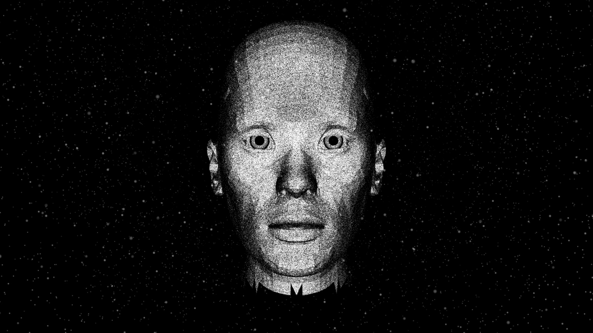

# Claude Face

### Give Claude a face

> **Unofficial community project.** Not affiliated with, endorsed by, or produced by Anthropic. "Claude" is a trademark of Anthropic; this repo simply gives one a face.

[](https://ptakaya.github.io/claude-face/)

**Your AI assistant, with a face that talks back.** A WebGL particle "talking head" -- a face rendered as a cloud of ~800k dots that lip-syncs to speech -- wired to your own local Claude. Type to it and Claude answers *out loud*, through the face. It's the "give your Jarvis a face" idea, made real.

**[▶ Try the live demo](https://ptakaya.github.io/claude-face/)** -- drag to orbit her in your browser, no install needed. *(The live demo is the face itself; the two-way talking runs locally via the bridge, below.)*

The face is plain browser + Node -- no build step, and **no `npm install` to render it** (Three.js loads from a pinned CDN). The bridge is optional. The Claude brain is optional. Run just the face, add a mock brain, or wire in a real Claude Code session.

---

## Three levels

You choose how far up the stack you go. Each level adds one moving part.

### Level 1 -- the face alone (browser + Node, no Claude)
The particle head renders in the browser and lip-syncs. No bridge, no Claude account, no subscription. This is the renderer by itself. (To actually *hear* it speak you also need the optional voice engine -- see [Voice](#voice-optional-all-levels) -- but the face draws and animates without it.)

### Level 2 -- the mock bridge (canned replies, Node only, no Claude)
Adds the bridge relay running with its **default `mock` backend**. You type into a talk box, and a deterministic canned reply streams back through her mouth. This proves the whole two-way plumbing -- WebSocket, streaming sentences, "thinking" dots, viseme playback -- with **zero Claude account and zero usage**. Node only.

### Level 3 -- the real Claude brain (`BRAIN_BACKEND=cli`)
Swaps the mock for a real Claude Code session. Requires **Claude Code installed and authenticated** on the machine. Each turn spawns a fresh headless `claude -p`, streams the reply, and exits -- **no terminal stays open**, nothing is left running between turns. You must set **`BRAIN_CWD`** to the working directory the session should run in. Read the [Security](#security) note before you enable this.

---

## Quickstart

Copy-paste. Level 2 (mock) is the recommended first run -- it needs no Claude. **Shortcut:** after the bridge `npm install` below, run `npm start` from the repo root to launch both servers at once. Or run them in two terminals:

### Terminal A -- serve the face (:8610)

```bash
cd phase1
npm run serve   # zero-dependency Node static server on :8610 (Three.js loads from a pinned CDN — no install, no build)
```

Then open:

```
http://localhost:8610/
```

The shipped head loads by default -- no query params needed. You get the clean app window (the same view as the live demo). **Click once anywhere on the page** to unlock browser audio (browsers block sound until a user gesture lands). That is enough to see Level 1. (To also *hear* her, run the optional voice engine -- see [Voice](#voice-optional-all-levels).)

Want to play with her look? Add **`?panel=1`** to the URL to open the full tuning dashboard -- particle density, mouth weighting, eyes, hair, lighting, and a Speak test button.

### Terminal B -- run the bridge (Levels 2 and 3)

```bash
cd bridge
npm install
npm start                        # BRAIN_BACKEND defaults to "mock" -- the safe, no-Claude path
```

The relay binds to `127.0.0.1:8765` and **prints a ready-to-open URL** that already includes the per-install token and the bridge port, e.g.:

```
http://localhost:8610/?app=1&token=<generated>&bridgePort=8765
```

Open that URL, click once to unlock audio, type a line in the talk box, and the **mock** brain streams a canned reply through her mouth. That is Level 2.

### Opt into the real Claude brain (Level 3)

Stop the bridge, then start it with the `cli` backend and a working directory:

```bash
cd bridge
BRAIN_BACKEND=cli BRAIN_CWD="/absolute/path/to/a/workspace" npm start
```

- `BRAIN_BACKEND=cli` -- use a real Claude Code session instead of the mock.
- `BRAIN_CWD` -- **required**; the directory the spawned `claude -p` runs in (its context, its `CLAUDE.md`, its files).
- Requires Claude Code installed and authenticated. A fresh `claude -p` is spawned per turn and exits when the turn ends -- no long-lived process.

Optional dials (all have sane defaults): `BRAIN_MODEL` (default `sonnet`), `BRAIN_EFFORT`, `BRAIN_TOOLS` (unset = full tools; `""` = read-only face), `SF_BRIDGE_PORT` (default `8765`), `SF_PAGE_PORT` (default `8610`).

---

## Voice (optional, all levels)

The mouth is driven by [HeadTTS](https://github.com/met4citizen/HeadTTS), which returns audio **and** native viseme timestamps. It is fetched and run **separately** from this repo.

```bash
git clone https://github.com/met4citizen/HeadTTS
```

Follow HeadTTS's own README to install it and download its model (~326 MB). The face calls the voice engine at **`http://127.0.0.1:8882/v1/synthesize`** (hardcoded in `phase1/main.js`), using the `bf_isabella` voice -- run HeadTTS so it answers on that host, port, and endpoint. Without it the face still renders and animates; it just has no audio to lip-sync to, and the Speak button reports the voice server as unreachable.

---

## Ports

| Port | Who | What |
|------|-----|------|
| `8610` | `phase1` static server | serves the face page (`SF_PAGE_PORT` the relay advertises) |
| `8765` | `bridge/relay.mjs` | HTTP + WebSocket relay, loopback only (`SF_BRIDGE_PORT`) |
| `8882` | HeadTTS (separate) | voice synthesis at `/v1/synthesize` |

---

## Security

**Read this before you set `BRAIN_BACKEND=cli`.**

- **`mock` is the default and is safe.** It generates canned text, touches no network, uses no Claude account, and cannot run anything on your machine. Levels 1 and 2 are safe by construction.
- **`cli` is an explicit opt-in that runs a real Claude with permissions bypassed and full tools.** The session is spawned with `--permission-mode bypassPermissions` and the **complete built-in toolset** (Bash, Write, Edit, Read, Task, and any configured MCP servers). That means **anything typed into the talk box can cause Claude to run shell commands, read, write, and modify files on the machine** -- with no confirmation prompt. Treat the talk box as a terminal with full local access.
- The relay is bound to `127.0.0.1` only and gated by a per-install token that the relay generates and prints. That keeps random local pages out; it does **not** sandbox what the `cli` brain can do once you talk to it.
- Only enable `cli` on a machine and in a `BRAIN_CWD` where you are comfortable with that level of access. If you want the two-way experience without the risk, stay on `mock`, or narrow the brain to a read-only face with `BRAIN_TOOLS=""`.

**The default (`mock`) needs no Claude installation and no account.** You can run and evaluate the entire face + bridge experience without ever touching a Claude subscription.

---

## Layout

```
phase1/                 the face: browser renderer (Three.js) + static assets
  index.html            page shell + importmap
  main.js               particle renderer, viseme lip-sync, bridge client
  vendor/
    head-default.glb   the shipped head mesh (CC0 -- see ATTRIBUTION.md)
bridge/                 the optional two-way voice bridge (Node)
  relay.mjs             loopback HTTP + WebSocket relay, token gate
  brain.mjs            the brain: mock (default) or cli (real Claude Code)
  cleanForTts.mjs       strips markdown/code/emoji before speech
```

## License

This project's code is dedicated to the public domain under **CC0 1.0**. See [LICENSE](LICENSE) and [ATTRIBUTION.md](ATTRIBUTION.md).
